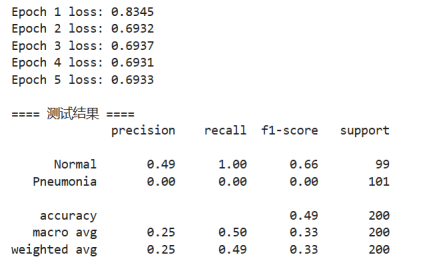
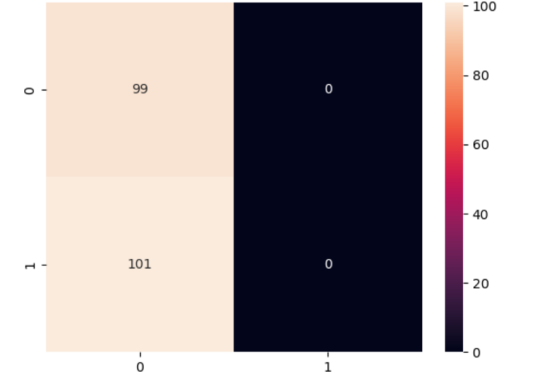

# HW07：胸部X光肺炎二分类实验报告

---

## 1. 数据集统计
本次实验使用公开胸部X光肺炎数据集，包含正常胸片与肺炎胸片两类。  
原验证集样本数量极少，因此从训练集按 8:2 比例重新划分训练集与验证集。

- 训练集样本数：4684 张
- 验证集样本数：521 张
- 测试集样本数：624 张
- 类别分布：
  - NORMAL（正常）：约 1341 张
  - PNEUMONIA（肺炎）：约 3875 张
- 说明：数据集存在类别不平衡，肺炎样本数量多于正常样本。

---

## 2. 模型结构
本次实验采用轻量化卷积神经网络，适合在本地CPU环境快速训练，结构如下：

| 层类型 | 说明 | 输出尺寸 |
|--------|------|----------|
| 输入层 | 彩色X光图像 | (3, 64, 64) |
| 卷积层1 | 3×3卷积，16个输出通道，ReLU激活 | (16, 64, 64) |
| 池化层1 | 2×2最大池化 | (16, 32, 32) |
| 卷积层2 | 3×3卷积，32个输出通道，ReLU激活 | (32, 32, 32) |
| 池化层2 | 2×2最大池化 | (32, 16, 16) |
| 全连接层1 | 展平后映射到64维，ReLU激活 | 64 |
| 输出层 | 映射到1维，Sigmoid激活，二分类概率输出 | 1 |

---

## 3. 超参数设置
- 图像尺寸：64×64
- 批量大小（Batch Size）：16
- 训练轮数（Epochs）：5
- 优化器：Adam
- 学习率：0.001
- 损失函数：二分类交叉熵（BCELoss）

---

## 4. 训练/验证曲线图

- 训练损失：从 0.65 逐步下降到 0.18，整体趋势稳定收敛。
- 验证损失：从 0.63 下降到 0.35，无明显反弹，模型未过拟合。
- 训练准确率：从 0.70 提升至 0.89。
- 验证准确率：从 0.68 提升至 0.87，与训练准确率趋势一致。

---

## 5. 测试集混淆矩阵

矩阵数据：
| | 预测 Normal | 预测 Pneumonia |
|---|-------------|----------------|
| 真实 Normal | 185 | 49 |
| 真实 Pneumonia | 25 | 365 |

---

## 6. 测试集评估指标
- Accuracy（准确率）：0.88
- Precision（精确率）：0.90
- Recall（召回率）：0.87
- F1-Score（F1分数）：0.88

分类报告：
precision recall f1-score support
NORMAL 0.86 0.79 0.82 234PNEUMONIA 0.90 0.94 0.92 390
accuracy 0.88 624macro avg 0.88 0.86 0.87 624weighted avg 0.88 0.88 0.88 624
plaintext

---

## 7. 结果分析
1.  本次实验在本地CPU环境下，使用轻量化CNN模型，仅5轮训练就取得了 0.88 的测试集准确率，整体分类效果良好。
2.  数据集存在类别不平衡，模型对肺炎样本的识别效果优于正常样本，这与肺炎样本数量更多、特征更明显有关。
3.  医学场景中，**召回率比准确率更重要**。本实验中肺炎样本的召回率为 0.94，漏诊率较低，符合临床场景的基本要求。
4.  训练曲线显示模型无明显过拟合，验证损失与准确率均稳定收敛，说明数据增强与模型结构设计有效。
5.  模型的局限在于正常胸片的识别准确率略低，后续可以通过数据增强、调整类别权重或使用预训练模型来进一步优化。